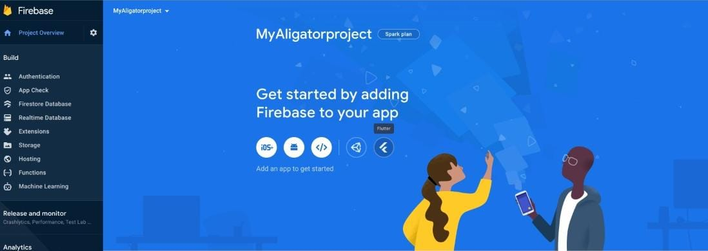
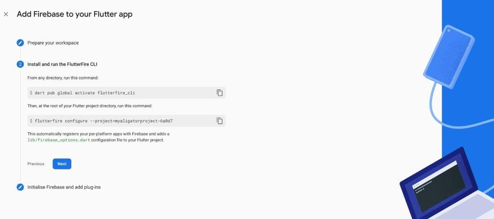

# FoodFast (IIITB Canteen App)
<h1>Setting up the Project</h1>
The first step in your Flutter application development is to install an IDE (Integrated Development Environment). In theory, IDE is not needed and you can use only the SDK and any text editor for development.However, IDEs provide features like syntax highlighting, code completion, and debugger which are very helpful during the development process. In this tutorial, we will use Visual Studio along with an Android Simulator to run this project.

Install VS Code from https://code.visualstudio.com/download.

<h1></h1>
Flutter also provides official plugins for IntelliJ and Visual Studio Code. In case of Android Studio and IntelliJ, don’t forget to restart the IDE to activate the newly installed plugins (this is not needed for VS Code). Note that only stable versions of IDEs are supported, the Flutter plugin may not function properly on Beta, Canary, or EAP (Early Access Preview) builds.
<h1></h1>

Lets Begin by installing all the required dependencies to run a flutter application.
For this tutorial we will be assuming that you have flutter SDK and Android Studio installed in your system.

<h1>Setting up your Android Emulator(iOS)</h1>
 <div>In the case of iOS simulator, we first need to open it using the dropdown device menu:</div>
  
  
  The Xcode installer will prompt you to install the missing components (if there are any). After a while, the simulator should appear and become available on the device menu.

Things are a little bit more complicated in the case of a physical iOS device. Assuming that the device is connected via a USB cable and unlocked (keep in mind the additional key prompt after connecting a cable), we first need to open the iOS module in Xcode:
 
 <div>Then go to the Signing & Capabilities settings tab and add a new personal team:</div>
  
  
  Sign in to your Apple ID (create a new one if needed). After closing the Accounts window, provisioning profiles will be generated.

If you get an error which states that the app identifier cannot be registered like this:
  
  
  
  It means that someone is already using your identifier. You need to change the Bundle Identifier value to something else.

After signing is configured, you can try to run the app from Android Studio. The first attempt will fail because the provisioning profile is not trusted on the device. You need to trust it in Profiles & Device Management settings:
 <div></div>
  
  Note that at the time of writing this article, it’s impossible to run Flutter apps provisioned using (free of charge) Personal Team provisioning profiles on devices running on iOS 13.3.1. It’s a limitation introduced by Apple. You can watch this issue to be notified about progress.

Once the profile is trusted, you can launch the app from the home screen.

 <h2>Setting Up your Android Emulator(Android Studio)</h2>
  
  In the case of a physical Android device, it needs to be connected via a USB cable and have USB debugging enabled (see how to do that in the official developer guide).

In the case of an Android emulator, we need to create a virtual device. First, let’s open the AVD manager by either using the icon on the toolbar or pressing Ctrl+Alt+F12 (Cmd+Alt+F12 on macOS) and typing the action name.
  

 <div>Leave default settings on the next screens:</div>
  
  
  
  Creating an AVD is a one-off action. Once created, it will be available until explicitly removed.

Now it’s time to run our app! Choose the desired device or emulator and press Shift+F10 (Ctrl+R on macOS) or use the Run button.
 
 ## Setting up your Android Emulator(VS CODE)

### To prepare to run and test your Flutter app on the Android emulator, follow these steps:

<h4>Step 1: Enable VM acceleration on your machine.</h4>

<h4>Step 2: Launch Android Studio, click the AVD Manager icon, and select Create Virtual Device.</h4>

* In older versions of Android Studio, you should instead launch Android Studio > Tools > Android > AVD Manager and select Create Virtual Device…. (The Android submenu is only present when inside an Android project.)

* If you do not have a project open, you can choose Configure > AVD Manager and select Create Virtual Device…

<h4>Step 3: Choose a device definition and select Next.</h4>

<h4>Step 4: Select one or more system images for the Android versions you want to emulate, and select Next. An x86 or x86_64 image is recommended.</h4>

<h4>Step 5: Under Emulated Performance, select Hardware - GLES 2.0 to enable hardware acceleration.</h4>

<h4>Step 6: Verify the AVD configuration is correct, and select Finish.</h4>

<h4>Step 7: In Android Virtual Device Manager, click Run in the toolbar. The emulator starts up and displays the default canvas for your selected OS version and device.</h4>

#### Now that we have installed all the dependencies,we are ready to run the project in VS Code.
  

  
 <h1>Launch The Project</h1>

<h3>Step 1: Open the command palette in VS Code using the shortcut ctrl+shift+P or selecting it in the 'View' Dropdown Menu.</h3>
  
 

<h3>Step 2: Launch the Flutter Emulator.</h3>
 
 

<h3>Step 3: Once the Flutter Emulator is active,you can launch the Android App from the
"main.dart" file by running the following command in the Terminal.</h3>
 
 ```flutter run```
 
 

 
 <h1> Setting up Firebase Project</h1>

First, log in with your Google account to manage your Firebase projects. From within the Firebase dashboard, select the Create new project button and give it a name:


<div>Next, we’re given the option to enable Google Analytics. This tutorial will not require Google Analytics, but you can also choose to add it to your project.</div>

 

If you choose to use Google Analytics, you will need to review and accept the terms and conditions prior to project creation.

After pressing Continue, your project will be created and resources will be provisioned. You will then be directed to the dashboard for the new project.
 
 <h1>Adding Android,Ios and Web support</h1>

In your project dashboard,click the flutter icon,



Now follow all the steps mentioned in this page,

Note:Make sure you login to your firebase account while you initialise your firebase_cli in your terminal.


 
 
This automatically registers your per-platform apps with Firebase and adds a ```lib/firebase_options.dart``` configuration file to your Flutter project.
 
 
 <h4>Note: Make sure that you have playstore installed in the Android Emulator device that you use.</h4>
 
 
 <h4>Note: Run the following command to resolve any dependencies.</h4>
 
 ```flutter pub get```
 
 <h4>Note: Use the following command to run the project.</h4>
 
 ``` flutter run --no-sound-null-safety```
 
There are additional steps for installing the Firebase SDK and adding initialization code, but they are not necessary for this tutorial.

That’s it! Have a great day!
