# FoodFast
<h4>IIITB Canteen  App</h4>
<h1>Setting up the Project</h1>
The first step in your Flutter application development is to install an IDE (Integrated Development Environment). In theory, IDE is not needed and you can use only the SDK and any text editor for development.However, IDEs provide features like syntax highlighting, code completion, and debugger which are very helpful during the development process. In this tutorial, we will use Visual Studio along with an Android Simulator to run this project.
<h1></h1>
Flutter also provides official plugins for IntelliJ and Visual Studio Code. In case of Android Studio and IntelliJ, don’t forget to restart the IDE to activate the newly installed plugins (this is not needed for VS Code). Note that only stable versions of IDEs are supported, the Flutter plugin may not function properly on Beta, Canary, or EAP (Early Access Preview) builds.

Lets Begin by installing all the required dependencies to run a flutter application.

## Linux
### Installing Flutter and updating path variable.

<h3>Step 1: Install snapd for Linux using the following command</h3>

``` sudo apt update && sudo apt install snapd ```


  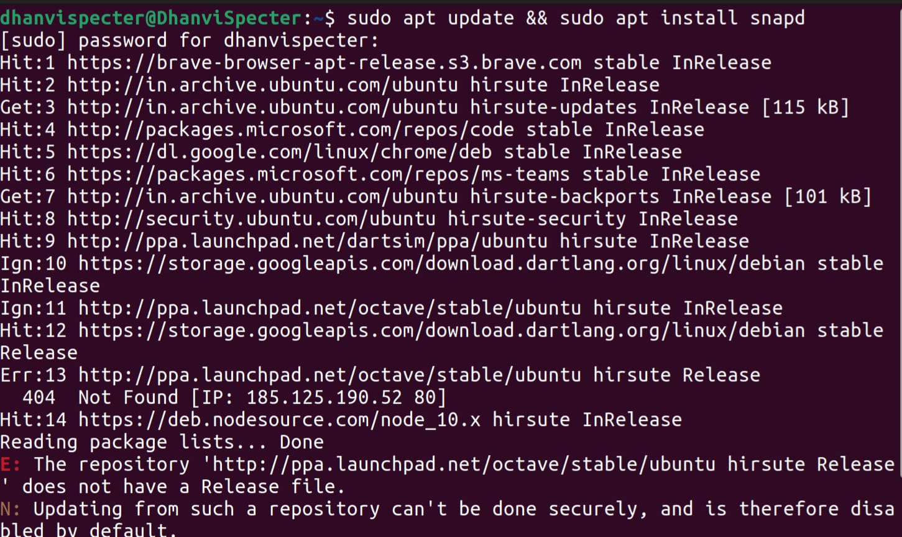

<h3>Step 2: Enter the following command in Terminal to install Flutter</h3>

``` sudo snap install flutter --classic ```

<h3>Step 3: Run flutter doctor to resolve dependencies</h3>

 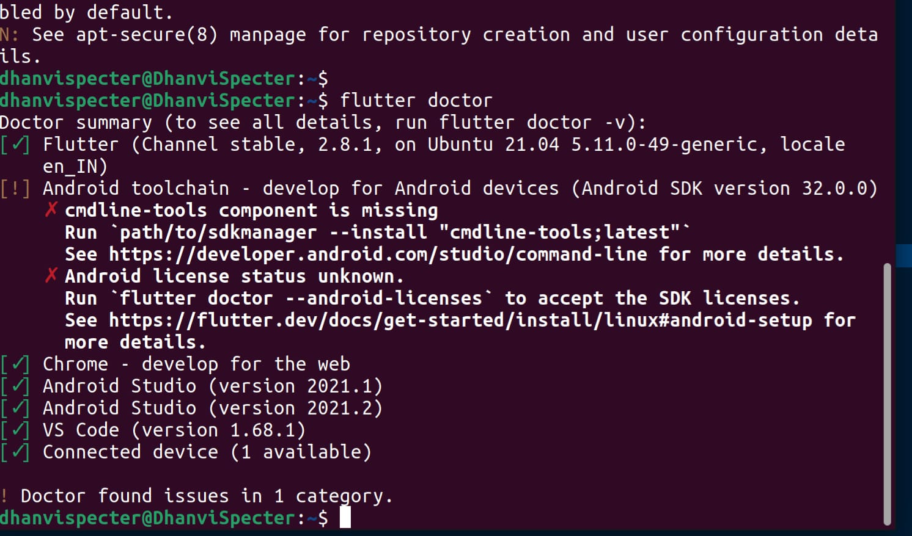


<h3>Step 4:Update your path.You’ll probably want to update this variable permanently,
so you can run flutter commands in any terminal session.</h3>


* .Determine the path of your clone of the Flutter SDK. You need this in Step 3.

* Open (or create) the rc file for your shell. For example, Linux uses the Bash shell by default, so edit $HOME/.bashrc. If you are using a different shell, 
the file path and filename will be different on your machine.

* .run ``` export PATH="$PATH:[PATH_OF_FLUTTER_GIT_DIRECTORY]/bin" ``` to add to PATH.

* use ``` flutter sdk-path ``` command to find your path.


* .Verify that the flutter/bin directory is now in your PATH by running: ```echo $PATH```.

<h1></h1>

## Installing Android Studio
<h4>Note: Flutter relies on a Full Installation of Android Studio to supply its 
Android platform dependencies.</h4>

<h3>Step 1: Install Android Studio from https://developer.android.com/studio.</h3>

<h3>Step 2: Download and install Android Studio.</h3>

<h3>Step 3: Start Android Studio, and go through the ‘Android Studio Setup Wizard’. This installs the latest Android SDK, Android SDK Command-line Tools, and Android SDK Build-Tools, which are required by Flutter when developing for Android.</h3>

<h3>Step 4: Run flutter doctor to confirm that Flutter has located your installation of Android Studio. If Flutter cannot locate it.</h3>

<h3>Step 5: Run the following command to set the directory that Android Studio is installed to.
Now it’s time to create a new project. On the welcome screen, choose Start a new Flutter Project and select Flutter Application on the next screen.</h3>

 ```flutter config --android-studio-dir <directory>```
 
  <h1> iOS</h1>
 <div>In the case of iOS simulator, we first need to open it using the dropdown device menu:</div>
  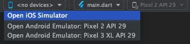
  
  The Xcode installer will prompt you to install the missing components (if there are any). After a while, the simulator should appear and become available on the device menu.

Things are a little bit more complicated in the case of a physical iOS device. Assuming that the device is connected via a USB cable and unlocked (keep in mind the additional key prompt after connecting a cable), we first need to open the iOS module in Xcode:
 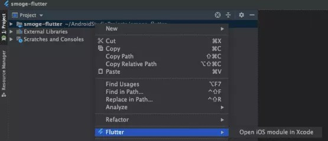
 <div>Then go to the Signing & Capabilities settings tab and add a new personal team:</div>
  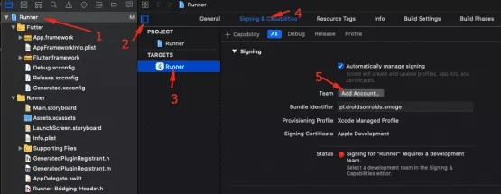
  
  Sign in to your Apple ID (create a new one if needed). After closing the Accounts window, provisioning profiles will be generated.

If you get an error which states that the app identifier cannot be registered like this:
  
  
  
  It means that someone is already using your identifier. You need to change the Bundle Identifier value to something else.

After signing is configured, you can try to run the app from Android Studio. The first attempt will fail because the provisioning profile is not trusted on the device. You need to trust it in Profiles & Device Management settings:
 <div></div>
  
  Note that at the time of writing this article, it’s impossible to run Flutter apps provisioned using (free of charge) Personal Team provisioning profiles on devices running on iOS 13.3.1. It’s a limitation introduced by Apple. You can watch this issue to be notified about progress.

Once the profile is trusted, you can launch the app from the home screen.

 <h1>Android</h1>
  
  In the case of a physical Android device, it needs to be connected via a USB cable and have USB debugging enabled (see how to do that in the official developer guide).

In the case of an Android emulator, we need to create a virtual device. First, let’s open the AVD manager by either using the icon on the toolbar or pressing Ctrl+Alt+F12 (Cmd+Alt+F12 on macOS) and typing the action name.
  

 <div>Leave default settings on the next screens:</div>
  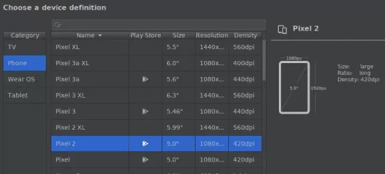
  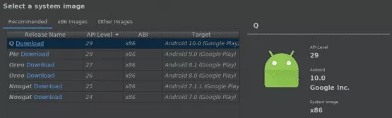
  
  Creating an AVD is a one-off action. Once created, it will be available until explicitly removed.

Now it’s time to run our app! Choose the desired device or emulator and press Shift+F10 (Ctrl+R on macOS) or use the Run button.
 
 ## Setting up your Android Emulator(VS CODE)

#### To prepare to run and test your Flutter app on the Android emulator, follow these steps:

<h3>Step 1: Enable VM acceleration on your machine.</h3>

<h3>Step 2: Launch Android Studio, click the AVD Manager icon, and select Create Virtual Device.</h3>

* In older versions of Android Studio, you should instead launch Android Studio > Tools > Android > AVD Manager and select Create Virtual Device…. (The Android submenu is only present when inside an Android project.)

* If you do not have a project open, you can choose Configure > AVD Manager and select Create Virtual Device…

<h3>Step 3: Choose a device definition and select Next.</h3>

<h3>Step 4: Select one or more system images for the Android versions you want to emulate, and select Next. An x86 or x86_64 image is recommended.</h3>

<h3>Step 5: Under Emulated Performance, select Hardware - GLES 2.0 to enable hardware acceleration.</h3>

<h3>Step 6: Verify the AVD configuration is correct, and select Finish.</h3>

<h3>Step 7: In Android Virtual Device Manager, click Run in the toolbar. The emulator starts up and displays the default canvas for your selected OS version and device.</h3>

#### Now that we have installed all the dependencies,we are ready to run the project in VS Code.
  

  
 <h1>Launch</h1>

<h3>Step 1: Open the command palette in VS Code using the shortcut ctrl+shift+P or selecting it in the 'View' Dropdown Menu.</h3>
  
 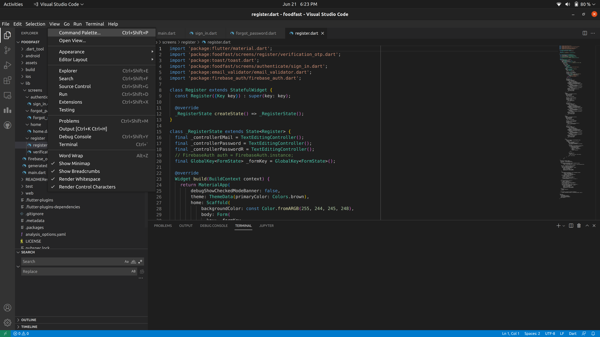

<h3>Step 2: Launch the Flutter Emulator.</h3>
 
 

<h3>Step 3: Once the Flutter Emulator is active,you can launch the Android App from the
main.dart file by running the following command in the Terminal.</h3>
 
 ```flutter run```
 
 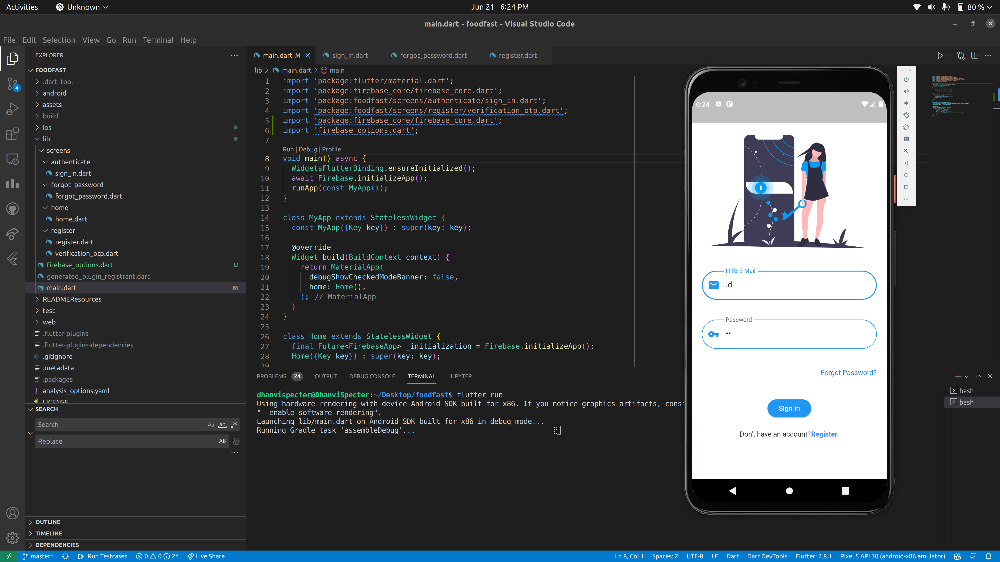

 
 <h1> Setting up Firebase Project</h1>

First, log in with your Google account to manage your Firebase projects. From within the Firebase dashboard, select the Create new project button and give it a name:

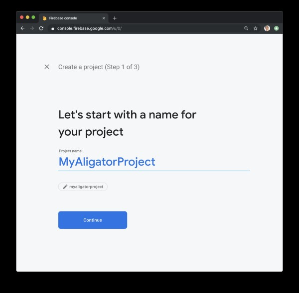
 <div>Next, we’re given the option to enable Google Analytics. This tutorial will not require Google Analytics, but you can also choose to add it to your project.</div>

 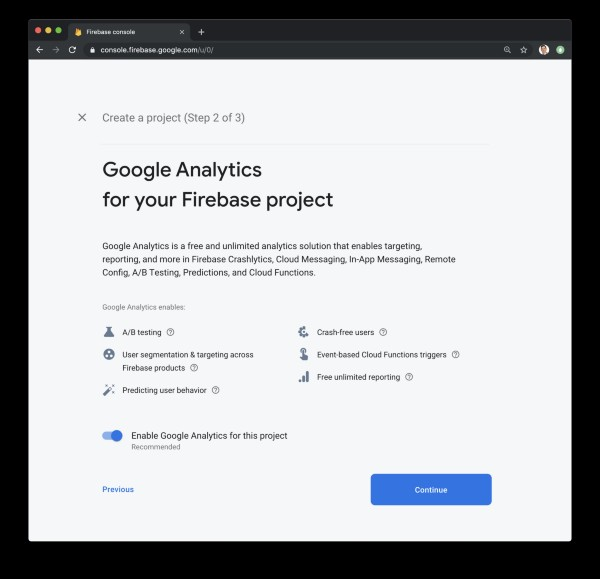
 If you choose to use Google Analytics, you will need to review and accept the terms and conditions prior to project creation.

After pressing Continue, your project will be created and resources will be provisioned. You will then be directed to the dashboard for the new project.
 
 <h1>Adding Android support</h1>
 <h2>Registering the App</h2>
 
In order to add Android support to our Flutter application, select the Android logo from the dashboard. This brings us to the following screen:

 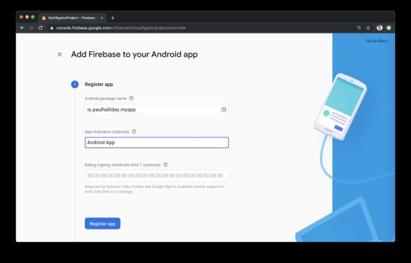

The most important thing here is to match up the <b>Android package name</b> that you choose here with the one inside of our application.

The structure consists of at least two segments. A common pattern is to use a domain name, a company name, and the application name:

 <div>com.example.flutterfirebaseexample</div>
Once you’ve decided on a name, open android/app/build.gradle in your code editor and update the applicationId to match the <b>Android package name:</b>
<div>In android/app/build.gradle file</div>
 <pre>
...
defaultConfig {
    // TODO: Specify your own unique Application ID (https://developer.android.com/studio/build/application-id.html).
    applicationId 'com.example.flutterfirebaseexample'
    ...
}
...
 </pre>
 
 You can skip the app nickname and debug signing keys at this stage. Select Register app to continue.

 <h2>Downloading the Config File</h2>
The next step is to add the Firebase configuration file into our Flutter project. This is important as it contains the API keys and other critical information for Firebase to use.

 Select Download <b>google-services.json</b> from this page:
 <div></div>
 Next, move the google-services.json file to the android/app directory within the Flutter project.

 <h2>Adding the Firebase SDK</h2>
We’ll now need to update our Gradle configuration to include the Google Services plugin.

Open android/build.gradle in your code editor and modify it to include the following:
In android/build.gradle
<pre>
 buildscript {
  repositories {
    // Check that you have the following line (if not, add it):
    google()  // Google's Maven repository
  }
  dependencies {
    ...
    // Add this line
    classpath 'com.google.gms:google-services:4.3.6'
  }
}

allprojects {
  ...
  repositories {
    // Check that you have the following line (if not, add it):
    google()  // Google's Maven repository
    ...
  }
}
 </pre>
 Finally, update the app level file at android/app/build.gradle to include the following:
 In android/app/build.gradle
 <pre>
  apply plugin: 'com.android.application'
// Add this line
apply plugin: 'com.google.gms.google-services'

dependencies {
  // Import the Firebase BoM
  implementation platform('com.google.firebase:firebase-bom:28.0.0')

  // Add the dependencies for any other desired Firebase products
  // https://firebase.google.com/docs/android/setup#available-libraries
}
 </pre>
 With this update, we’re essentially applying the Google Services plugin as well as looking at how other Flutter Firebase plugins can be activated such as Analytics.

From here, run your application on an Android device or simulator. If everything has worked correctly, you should get the following message in the dashboard:
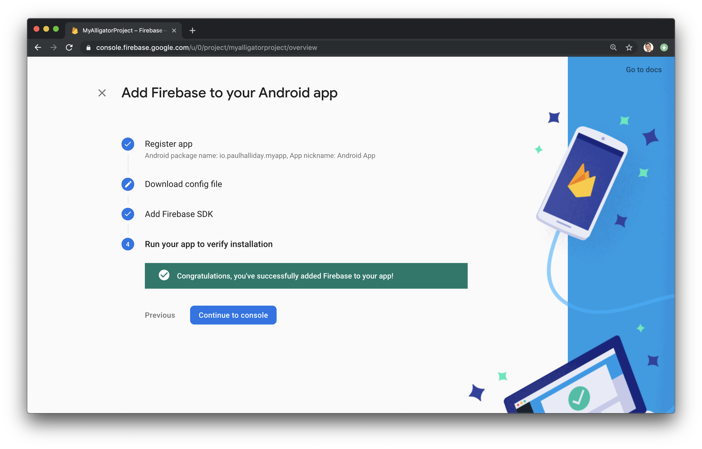
 
 Next up, let’s add iOS support!

 <h2>Adding iOS Support</h2>
In order to add Firebase support for iOS, we have to follow a similar set of instructions.

Head back over to the dashboard and select Add app and then iOS icon to be navigated to the setup process.

 <h2>Registering an App</h2>
Once again, we’ll need to add an “iOS Bundle ID”. It is possible to use the “Android package name” for consistency:
 
 You’ll then need to make sure this matches up by opening the iOS project up in Xcode at ios/Runner/Runner.xcodeproj and changing the <b>Bundle identifier</b> under General:
 
 Click <b>Register app</b> to move to the next screen.

 <b>Downloading the Config File</b>
In this step, we’ll need to download the configuration file and add this to our Xcode project
 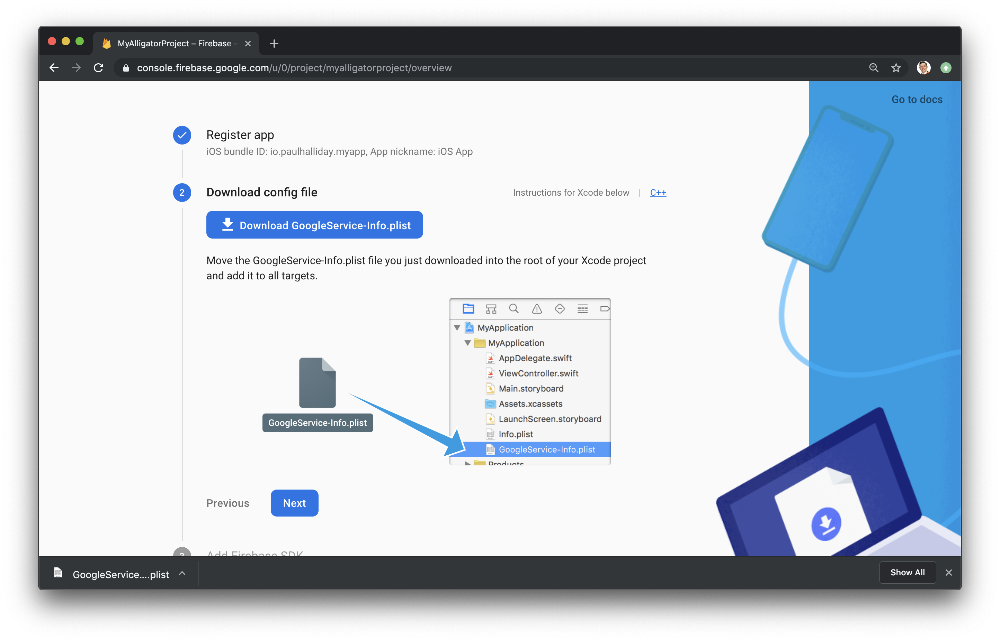
 <b>Download</b> GoogleService-Info.plist and move this into the root of your Xcode project within Runner:
 <div></div>
 Be sure to move this file within Xcode to create the proper file references.

There are additional steps for installing the Firebase SDK and adding initialization code, but they are not necessary for this tutorial.

That’s it!
